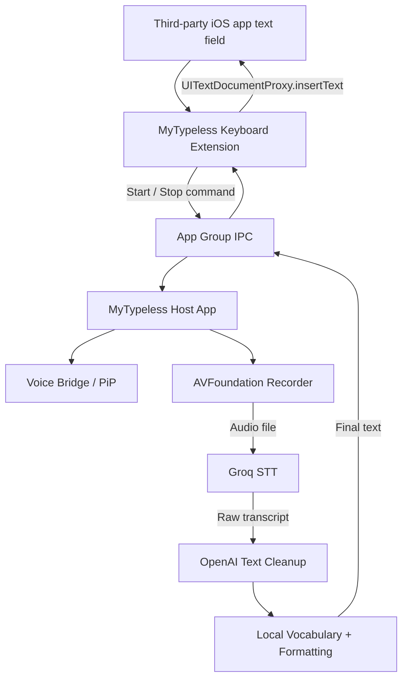

# MyTypeless — iOS MVP Product Requirements Document (PRD)

**Document version:** 1.0  
**Date:** 2026-09-25  
**Repository:** https://github.com/cloudaipro/MyTypeless  
**Target platform:** iPhone / iOS  
**MVP status:** Production MVP — not a prototype or technical spike  
**Primary implementation audience:** Codex / coding agent  
**Product working name:** MyTypeless

---

## 1. Executive Summary

MyTypeless is a voice-first iOS custom keyboard. The user should be able to open the MyTypeless keyboard inside a normal text field in apps such as Messages, Mail, Notes, Safari, ChatGPT, WhatsApp, and other apps that permit third-party keyboards, tap a microphone button, speak naturally, tap again to finish, and receive polished text directly in the current text field.

The MVP must solve the two difficult iOS requirements as part of the finished product:

1. A real system-wide iOS Custom Keyboard Extension.
2. Microphone recording initiated from the keyboard experience even though Apple does not allow a Custom Keyboard Extension itself to access the microphone.

The approved architecture is therefore:

- **MyTypeless Host App** owns microphone recording, Groq STT, OpenAI cleanup, API keys, personal vocabulary, settings, and the Picture-in-Picture Voice Bridge.
- **MyTypeless Keyboard Extension** provides offline/basic keyboard input, sends start/stop voice commands to the Host App through an App Group IPC layer, receives the processed result, and inserts it with `UITextDocumentProxy`.
- **Picture-in-Picture Voice Bridge** keeps the Host App in a user-authorized background/PiP state so the Host App can respond to keyboard commands without the keyboard directly using the microphone.
- **No private APIs, no prohibited automatic launch of the Host App from the keyboard, and no network/API keys inside the Keyboard Extension.**

This MVP intentionally has **one voice-input workflow only**. It does **not** have Dictate/Edit/Translate modes, Help Me Write, Ask AI, text rewriting commands, or translation.

The repository is currently empty. Codex must create the iOS project and all source files from scratch.

---

## 2. Product Vision

### 2.1 Problem

Voice-input products are useful, but product-level limits can make them unsuitable for heavy daily use. MyTypeless should provide a similar voice-first experience while using the user's own Groq and OpenAI API credentials.

MyTypeless itself must not impose a weekly word quota.

External API providers may still have their own billing, quotas, rate limits, or account restrictions.

### 2.2 Product promise

> Speak naturally. MyTypeless turns your speech into clean, ready-to-use text directly in the current iPhone text field.

### 2.3 Design principle

The MVP should do one thing extremely well:

> **Voice → polished text → current cursor**

Do not expand the MVP into a general AI assistant.

---

## 3. MVP Scope

### 3.1 P0 — Required for MVP release

All items below are release-blocking.

- iOS Host App.
- iOS Custom Keyboard Extension.
- Basic keyboard typing that works without Full Access and without network access.
- Next-keyboard / globe button.
- Full Access setup and detection/status guidance.
- Picture-in-Picture Voice Bridge using public Apple APIs.
- Keyboard-to-Host App command transport through an App Group.
- Host-to-Keyboard result transport through the App Group.
- Start recording from the MyTypeless keyboard while Voice Bridge is active.
- Stop recording from the MyTypeless keyboard.
- Visible recording and processing states on the keyboard.
- Microphone remains off while idle.
- Groq Speech-to-Text.
- OpenAI text cleanup.
- Traditional Chinese voice input.
- English voice input.
- Mixed Traditional Chinese + English speech.
- Self-correction cleanup, such as “tomorrow — no, Monday”.
- Filler/repetition cleanup.
- Automatic punctuation and basic formatting.
- Personal Dictionary.
- Groq API key storage in Keychain.
- OpenAI API key storage in Keychain.
- No MyTypeless word-usage quota.
- Network/API/microphone/bridge error handling.
- Session idempotency so results are never inserted twice.
- Recovery when Keyboard Extension is recreated by iOS.
- Safe handling when the keyboard disappears while processing.
- English and Traditional Chinese app UI localization.
- Accessibility labels for all important controls.
- Privacy disclosure describing Groq/OpenAI processing.
- Production logging without logging user speech/text content.
- Unit tests and real-device integration tests.
- Release acceptance criteria in this PRD must pass.

### 3.2 Explicitly NOT in MVP

Do not implement these features during MVP unless required to fix a P0 defect:

- Dictate mode.
- Edit mode.
- Translate mode.
- Mode selector.
- Help Me Write.
- Ask AI.
- Voice commands that modify existing text.
- Reading or sending document context around the cursor to an AI service.
- Selected-text editing.
- Translation.
- Automatic language translation.
- Swipe-to-type.
- Predictive text.
- AI autocomplete.
- Advanced autocorrect.
- User account system.
- Subscription.
- MyTypeless usage quota.
- Cloud history.
- Persistent transcription history.
- Audio history.
- Sync between devices.
- iCloud sync.
- Analytics SDKs.
- Advertising.
- In-app purchase.
- Backend server owned by MyTypeless.
- Android.
- iPad-specific layout optimization.
- macOS.
- watchOS.
- Offline speech recognition.
- Live/streaming partial transcription.
- Automatic silence-based start/stop.
- Voice cloning or TTS.

---

## 4. Reference Project: TypeGood

Reference:

https://github.com/ryanhuge/typegood

TypeGood is a macOS Swift application with a useful architecture:

- Audio recording
- STT service abstraction
- Groq Whisper implementation
- OpenAI LLM post-processing
- Text post-processing
- Personal vocabulary
- Settings
- Keychain/API key management
- A transcription pipeline

### 4.1 What MyTypeless should learn from TypeGood

Reimplement the following architectural ideas for iOS:

| TypeGood concept | MyTypeless implementation |
| --- | --- |
| `AudioRecorder` | iOS `VoiceRecorder` using AVFoundation |
| `STTService` | Keep service protocol abstraction |
| `GroqWhisperService` | Reimplement for iOS Host App |
| `LLMPostProcessor` | Reimplement as `TextCleanupService` |
| `TextPostProcessor` | Reimplement local formatting pipeline |
| `CustomVocabulary` | Reimplement Personal Dictionary |
| `SettingsStore` | Reimplement with iOS settings model |
| `KeychainHelper` | Reimplement with iOS Keychain |
| `TranscriptionPipeline` | Reimplement as `VoiceSessionCoordinator` |

### 4.2 What must NOT be ported

These are macOS-specific and must not be carried into MyTypeless:

- AppKit
- MenuBar UI
- `CGEvent`
- `HotkeyManager`
- macOS accessibility permission
- `TextInjector`
- macOS global shortcut logic
- macOS activation policy logic
- macOS-specific permission handling

### 4.3 Licensing rule

As observed on 2026-09-25, the public TypeGood repository does not expose a license file in its repository root.

Therefore:

- Treat TypeGood as an **architecture/reference implementation**.
- Do not copy substantial source code verbatim into MyTypeless unless licensing/permission is later clarified.
- Reimplement required behavior independently.
- Do not copy TypeGood branding or assets.

---

## 5. iOS Platform Constraints

Codex must design around Apple platform rules instead of trying to bypass them.

### 5.1 Custom Keyboard microphone restriction

A third-party iOS Custom Keyboard Extension does not get microphone access.

Therefore:

**The Keyboard Extension must never attempt to record audio.**

All microphone access belongs to the Host App.

### 5.2 Full Access

The Keyboard Extension must remain useful without Full Access.

Without Full Access:

- Alphabetic keyboard works.
- Numbers/symbols work.
- Delete works.
- Space works.
- Return works.
- Shift works.
- Next-keyboard/globe works.
- Voice button is visible but shows that Full Access/setup is required.

With Full Access:

- Basic keyboard continues to work.
- App Group command/result communication is enabled.
- Voice input can work when Voice Bridge is ready.

### 5.3 Keyboard must not launch the Host App

Do not implement:

- Custom URL scheme from Keyboard Extension to launch MyTypeless.
- `openURL` tricks to launch the containing app.
- Private APIs.
- Any mechanism whose purpose is to violate App Review Guideline 4.4.1.

If Voice Bridge is inactive, the keyboard must show:

> Open MyTypeless to activate Voice Bridge.

The user must activate/re-activate the bridge from the Host App.

### 5.4 Expected iOS limitations

These are not MyTypeless bugs:

- Third-party keyboards may not appear in secure/password fields.
- Third-party keyboards may not appear in some phone-pad fields.
- Individual third-party apps may disable custom keyboards entirely.
- iOS may terminate/recreate the keyboard extension process.
- PiP can be closed by the user.
- After a reboot or Host App termination, Voice Bridge may need to be reactivated.

These limitations must be documented in Help/Setup.

---

## 6. Target Technical Stack

### 6.1 Deployment target

- iOS 17.0+
- iPhone-first
- Portrait and landscape keyboard layouts must not break.
- Use current stable Xcode available at implementation time.
- Swift 5.10+ syntax.
- Swift Concurrency (`async/await`) for network and pipeline work.
- SwiftUI for Host App UI.
- `UIInputViewController` for the Keyboard Extension.
- UIKit keyboard UI may embed SwiftUI where appropriate, but keyboard lifecycle must remain controlled by `UIInputViewController`.

### 6.2 Apple frameworks

Use public Apple frameworks only:

- SwiftUI
- UIKit
- AVFoundation
- AVKit
- Security
- Foundation
- OSLog
- Combine only if necessary
- CoreFoundation for Darwin notifications if used

### 6.3 Third-party dependencies

Default rule:

> No third-party runtime libraries for MVP.

Use native `URLSession`, Keychain APIs, AVFoundation, AVKit, and native JSON encoding.

A dependency may only be added if it materially reduces risk and is documented in the PR with justification.

---

## 7. Xcode Project / Repository Structure

Use XcodeGen as the project source of truth, following the general reproducibility idea used by TypeGood.

Expected root:

```text
MyTypeless/
├── project.yml
├── README.md
├── docs/
│   └── MyTypeless_MVP_PRD_v1.0.md
├── MyTypeless/
│   ├── App/
│   ├── Features/
│   │   ├── Home/
│   │   ├── Onboarding/
│   │   ├── Dictionary/
│   │   └── Settings/
│   ├── VoiceBridge/
│   ├── Audio/
│   ├── Services/
│   ├── Storage/
│   ├── Models/
│   └── Resources/
├── MyTypelessKeyboard/
│   ├── KeyboardViewController.swift
│   ├── UI/
│   ├── State/
│   └── Resources/
├── Shared/
│   ├── IPC/
│   ├── Models/
│   ├── Constants/
│   └── Utilities/
├── MyTypelessTests/
├── MyTypelessKeyboardTests/
└── scripts/
```

### 7.1 Targets

Create at least:

1. `MyTypeless`
   - iOS application
2. `MyTypelessKeyboard`
   - Custom Keyboard Extension
3. `MyTypelessTests`
   - Unit tests

Recommended identifiers:

```text
Host App:
com.cloudaipro.mytypeless

Keyboard:
com.cloudaipro.mytypeless.keyboard

App Group:
group.com.cloudaipro.mytypeless
```

If Apple Developer signing identifiers differ, centralize them in `project.yml`; do not scatter hard-coded identifiers throughout source.

### 7.2 Source sharing

`Shared/` may be compiled into both Host App and Keyboard targets.

Do not compile Host-only networking, Keychain API key access, AVFoundation recording, or OpenAI/Groq code into the Keyboard Extension.

---

## 8. High-Level Architecture



### 8.1 Architectural rule

The Keyboard Extension is a **thin client**.

It must not:

- Record audio.
- Store API keys.
- Call Groq.
- Call OpenAI.
- Persist audio.
- Perform expensive AI work.
- Maintain long-running tasks.
- Depend on the Host App process being foregrounded.

---

## 9. Core End-to-End User Flow

### 9.1 First-time setup

1. User launches MyTypeless.
2. User sees onboarding.
3. User grants microphone permission to MyTypeless Host App.
4. User enters Groq API key.
5. User enters OpenAI API key.
6. User receives keyboard installation instructions.
7. User enables MyTypeless keyboard in iOS Settings.
8. User enables Full Access for MyTypeless keyboard.
9. User returns to MyTypeless.
10. User taps **Start Voice Bridge**.
11. MyTypeless starts its PiP Voice Bridge using public AVKit APIs.
12. App verifies that Voice Bridge is alive.
13. User opens another app.
14. User selects MyTypeless keyboard.
15. Keyboard shows microphone as **Ready**.

### 9.2 Normal voice input

1. User taps microphone.
2. Keyboard immediately changes state to `Starting`.
3. Keyboard writes `startRecording(sessionID)` to App Group.
4. Keyboard sends cross-process notification.
5. Host receives command.
6. Host activates microphone/audio session.
7. Host starts recording.
8. Host publishes `recording`.
9. Keyboard displays active recording UI.
10. User speaks.
11. User taps microphone/stop.
12. Keyboard writes `stopRecording(sessionID)`.
13. Host stops recording.
14. Host publishes `processing`.
15. Host sends audio to Groq.
16. Host receives raw transcription.
17. Host sends transcript to OpenAI cleanup.
18. If cleanup succeeds, Host runs local post-processing.
19. If cleanup fails but STT succeeded, Host falls back to the STT text plus local post-processing.
20. Host writes final result to shared state.
21. Keyboard receives result.
22. Keyboard atomically claims the result.
23. Keyboard inserts text using `textDocumentProxy.insertText(finalText)`.
24. Keyboard acknowledges result.
25. Host clears active session data.
26. Keyboard returns to Ready.

### 9.3 Golden-path requirement

When Voice Bridge is active, the entire flow above must complete without bringing the Host App to foreground.

---

## 10. Keyboard Extension Requirements

### 10.1 Keyboard layout

The keyboard must be a usable keyboard, not only a microphone panel.

Default layout:

```text
┌─────────────────────────────────────┐
│        Voice status / Mic button    │
├─────────────────────────────────────┤
│  Q W E R T Y U I O P                │
│   A S D F G H J K L                 │
│    ⇧ Z X C V B N M ⌫                │
│  123  🌐     space      return      │
└─────────────────────────────────────┘
```

Exact visual styling is flexible; behavior is not.

### 10.2 Required typing behavior

P0:

- Lowercase letters.
- Shift uppercase.
- Caps lock by double-tap Shift, if practical.
- Delete.
- Delete repeat on press-and-hold.
- Space.
- Return.
- Next keyboard.
- `123` number/symbol page.
- Basic punctuation page.
- Keyboard adapts enough to portrait/landscape to avoid clipping.
- No network dependency for these functions.

### 10.3 Voice button states

Use an explicit state machine.

Possible UI states:

```text
Setup required
Bridge inactive
Ready
Starting
Recording
Processing
Result ready
Recover result
Error
```

### 10.4 State behavior

**Setup required**
- Full Access is not available or shared IPC is unavailable.
- Voice button disabled.
- Show concise setup text.

**Bridge inactive**
- Full Access exists.
- Host heartbeat is stale or PiP is not active.
- Voice button disabled.
- Show “Open MyTypeless to activate Voice Bridge.”

**Ready**
- Bridge heartbeat is healthy.
- Voice button enabled.

**Starting**
- Command sent; waiting for Host confirmation.
- Timeout if Host does not acknowledge.

**Recording**
- Show clear stop control.
- Provide haptic confirmation.
- Show elapsed time if practical.

**Processing**
- Prevent starting a second session.
- Show spinner/progress state.
- Basic keyboard typing may remain usable.

**Result ready**
- Immediately insert if the current keyboard session still owns the same voice session.

**Recover result**
- Used when keyboard was dismissed/recreated or insertion ownership is ambiguous.
- Never auto-insert ambiguous text into a potentially different text field.
- Provide explicit “Insert previous result” button.

**Error**
- Display concise error and action.
- Return to Ready if possible.

### 10.5 `hasDictationKey`

Because MyTypeless provides its own voice-input entry point, set `UIInputViewController.hasDictationKey` appropriately so iOS does not present a confusing duplicate system dictation control where applicable.

### 10.6 Text insertion

Use:

```swift
textDocumentProxy.insertText(finalText)
```

Do not use clipboard injection.

Do not simulate keystrokes.

Do not access surrounding document text for AI processing.

### 10.7 Privacy rule for keyboard

For MVP, the Keyboard Extension must not send:

- User keystrokes.
- Text before cursor.
- Text after cursor.
- Selected text.
- Clipboard contents.

to MyTypeless Host App, Groq, OpenAI, or any server.

Only voice session control metadata and the final voice result move through shared IPC.

---

## 11. Picture-in-Picture Voice Bridge

### 11.1 Purpose

The Voice Bridge exists because the Custom Keyboard Extension cannot access the microphone.

The Host App must remain in a user-authorized state in which it can receive App Group commands and start microphone recording while the user is working in another app.

### 11.2 Approved approach

Use public:

- `AVPictureInPictureController`
- AVKit-supported PiP content source
- AVFoundation audio session
- Background audio capability as required by Apple PiP architecture

Do not use:

- Private APIs.
- Fake system events.
- Background task abuse.
- Location/audio hacks unrelated to the feature.
- Automatic prohibited app launching from the keyboard.

### 11.3 User initiation

Starting Voice Bridge must be explicitly user initiated in the Host App.

Host App Home should contain:

```text
Voice Bridge

[ Start Voice Bridge ]

Status:
Inactive / Starting / Ready / Interrupted
```

Do not assume PiP can silently start on app launch.

### 11.4 PiP presentation

The PiP content should be legitimate user-facing MyTypeless voice status content, for example:

- MyTypeless icon.
- “Voice Ready”.
- Recording indicator while recording.
- Processing indicator when applicable.

Keep the PiP content minimal and low-overhead.

The user may move/tuck the PiP window using normal iOS behavior.

### 11.5 Idle microphone

**Critical requirement:**

The microphone must be OFF while `VoiceState == ready`.

Voice Bridge being active must not mean continuous microphone capture.

The microphone becomes active only after a valid start command.

Verify this using the iOS microphone privacy indicator during QA.

### 11.6 Heartbeat

Host writes a lightweight heartbeat to shared state while Voice Bridge is operational.

Recommended:

- Update every 2 seconds.
- Keyboard treats heartbeat older than 5 seconds as inactive.
- Include `bridgeInstanceID`.
- Reset instance ID whenever Host/Bridge restarts.

Example:

```json
{
  "bridgeInstanceID": "UUID",
  "state": "ready",
  "lastHeartbeat": "ISO-8601",
  "protocolVersion": 1
}
```

### 11.7 Bridge interruption

On interruption:

- Stop or safely pause recording.
- Publish `bridgeInterrupted`.
- Do not leave microphone running.
- Attempt to return to `ready` after the interruption ends if PiP remains active.
- If recovery fails, publish `inactive`.

Examples:

- Phone call.
- Siri.
- Audio route change.
- AirPods disconnect.
- PiP stopped.
- Host App terminated.

---

## 12. Cross-Process IPC

### 12.1 Technology

Use:

- App Group shared container for state/payload.
- Atomic file writes or App Group `UserDefaults` only for small state.
- Darwin notification center for wake/state-change notification if required.

Do not rely on normal `NotificationCenter` for cross-process delivery.

### 12.2 Protocol design

All commands and results must be versioned.

```swift
struct VoiceCommand: Codable {
    let protocolVersion: Int
    let commandID: UUID
    let sessionID: UUID
    let bridgeInstanceID: UUID
    let type: VoiceCommandType
    let createdAt: Date
}

enum VoiceCommandType: String, Codable {
    case start
    case stop
    case cancel
}
```

Shared session:

```swift
struct SharedVoiceSession: Codable {
    let protocolVersion: Int
    let sessionID: UUID
    var state: SharedVoiceState
    var resultID: UUID?
    var finalText: String?
    var error: SharedVoiceError?
    var updatedAt: Date
}
```

Suggested states:

```text
idle
startRequested
recording
stopRequested
transcribing
cleaning
resultReady
resultClaimed
completed
cancelled
failed
```

### 12.3 Atomicity

Do not partially overwrite shared JSON.

Recommended pattern:

1. Encode to temporary file.
2. `fsync` if necessary.
3. Atomically replace final state file.

### 12.4 Idempotency

Every command has a `commandID`.

Host must ignore a command already processed.

Every voice session has a `sessionID`.

Keyboard must only insert a result that belongs to its active/known session.

### 12.5 Duplicate-insertion prevention

A final result must never be automatically inserted twice.

Use a claim/ack workflow:

```text
resultReady
   ↓
keyboard claims resultID
   ↓
resultClaimed
   ↓
keyboard inserts once
   ↓
ack resultID
   ↓
completed
```

If keyboard dies in an ambiguous claimed state:

- Do not auto-insert on next launch.
- Show Recover Result UI requiring explicit user action.

### 12.6 Stale data

- Command TTL: 30 seconds.
- Active voice session safety timeout: 10 minutes.
- Recoverable final result TTL: 10 minutes.
- Clear stale state at Host startup.
- Never treat state from an old `bridgeInstanceID` as active.

---

## 13. Audio Recording

### 13.1 Ownership

Only Host App records.

### 13.2 AVAudioSession

Use an audio-session configuration suitable for speech capture and compatible with the chosen PiP implementation.

Preferred recording characteristics:

- 16 kHz
- mono
- 16-bit PCM WAV
- speech-focused audio session mode where appropriate

Support common input routes:

- Built-in microphone.
- Wired headset.
- Bluetooth headset/AirPods where iOS provides an input route.

### 13.3 Recording lifecycle

```text
ready
→ start command
→ activate audio session
→ start recorder
→ recording
→ stop command
→ stop recorder
→ deactivate/reconfigure recording audio session
→ processing
```

### 13.4 Minimum recording

If recording duration is less than 0.3 seconds:

- Treat it as accidental.
- Do not call APIs.
- Return keyboard to Ready.

### 13.5 Maximum recording

Safety maximum:

- 5 minutes per voice session.

This is not a usage quota. It prevents accidental indefinite recording and oversized requests.

At the limit:

- Stop automatically.
- Continue STT/cleanup.
- Inform the keyboard that maximum session length was reached.

### 13.6 Audio persistence

Audio file is temporary.

Required behavior:

```text
Record
→ upload to Groq
→ request completes/fails
→ delete local temporary audio in defer/finally
```

Do not:

- Save audio to Documents.
- Add audio to history.
- Sync audio.
- Put audio in App Group.
- Send audio to OpenAI cleanup.

---

## 14. Groq Speech-to-Text

### 14.1 Provider

MVP STT provider is fixed to Groq.

Do not build a provider-selection UI in MVP.

Still define:

```swift
protocol STTService {
    func transcribe(
        audioURL: URL,
        language: RecognitionLanguage,
        prompt: String?
    ) async throws -> STTResult
}
```

### 14.2 Endpoint

Use Groq OpenAI-compatible transcription endpoint:

```text
POST https://api.groq.com/openai/v1/audio/transcriptions
```

### 14.3 Default model

Use:

```text
whisper-large-v3-turbo
```

Centralize the model name in one configuration location.

Do not hard-code model strings in multiple files.

### 14.4 Request

Multipart fields:

- `file`
- `model`
- optional `language`
- optional `prompt`
- `response_format`
- `temperature`

Recommended:

```text
response_format = verbose_json
temperature = 0
```

### 14.5 Recognition language setting

MVP choices:

```text
Auto
Traditional Chinese
English
```

Mapping:

**Auto**
- Omit `language`.
- Preserve whatever languages are spoken.
- Best default for mixed Chinese/English use.

**Traditional Chinese**
- Send `language=zh`.
- LLM cleanup must normalize Chinese output to Traditional Chinese.
- Preserve English terms.

**English**
- Send `language=en`.

Default: